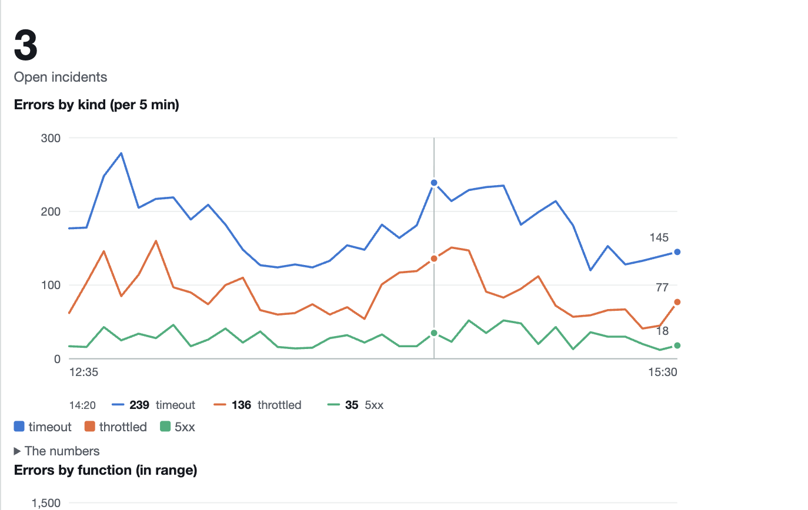

# LambdaWidgets

Build CloudWatch custom widgets in C#, and develop them on your machine instead of on a dashboard.

**Docs: <https://ipjohnson.github.io/LambdaWidgets>** · on nuget.org at `0.1.0-rc1000`

## From nothing to a widget you can click

```bash
dotnet new install LambdaWidgets.Templates::0.1.0-rc1000

dotnet new lw-logs  -n OrdersSearch    # a Logs Insights query
dotnet new lw-ddb   -n OrderLookup     # a DynamoDB query, paged
dotnet new lw-graph -n OrderMetrics    # a chart over CloudWatch metrics
```

Each one gives you a widget, a test project that already passes, and a `dashboard.json`. Two
processes and you are clicking:

```bash
dotnet run --project OrdersSearch           # the widget, under the AWS Lambda Test Tool
lambda-widgets --dashboard dashboard.json   # the console's side, on http://localhost:5080
```

## A widget is routes and views

The application composes modules and registers services. That is all it does.

```csharp
// OrdersSearchApp.cs
[HardenedModule]
[LambdaWidgetModule]
[Enable<WidgetTemplates>]
public partial class OrdersSearchApp : IServiceCollectionConfiguration {
    public void ConfigureServices(IServiceCollection services) =>
        services.AddSingleton<IAmazonCloudWatchLogs>(_ => new AmazonCloudWatchLogsClient());
}
```

Handlers are ordinary classes in their own files, found by the route table the generator builds:

```csharp
// Pages.cs
public class Pages(ILogQueries queries) {

    [Get("/")]
    [Output<Views.LandingPage>]
    public SearchPage Index([FromWidget] SearchRequest request, IWidgetContext context) =>
        new(request.Query, request.LogGroups, context, Results: null);

    [Get("/search")]
    [Output<Views.ResultsPage>]
    public async Task<SearchPage> Search(
        [FromWidget] SearchRequest request,
        IWidgetContext context,
        CancellationToken cancellationToken) {
        // The dashboard's range rather than a form field, so the widget covers the window the
        // viewer is looking at and follows them when they zoom it.
        var (start, end) = context.TimeRange.Effective;

        var results = await queries.Run(
            request.LogGroups, request.Query, start, end, request.Limit, cancellationToken);

        return new SearchPage(request.Query, request.LogGroups, context, results);
    }
}

public class SearchRequest {
    public string LogGroups { get; set; } = "";
    public string Query { get; set; } = "";
    public int Limit { get; set; } = 20;
}
```

`[FromWidget]` binds the widget's configured parameters, the viewer's form fields and the fields a
click carried, merged the way the console merges them. `[Output<TView>]` names the Razor view:

```razor
@* Views/LandingPage.cshtml *@
@inherits OrdersSearch.OrdersSearchAppWidgetTemplates<OrdersSearch.SearchPage>
@Widget.Root()
<form>
  <label>Query</label>
  <textarea name="query" rows="4">@Model.Query</textarea>
</form>
@Widget.Button("Run query", Links.Pages.Search(), primary: true)
@if (Model.Results is not null) {
  <table>
    @foreach (var row in Model.Results.Rows) {
      <tr>@foreach (var field in row.Fields) { <td>@field.Value</td> }</tr>
    }
  </table>
}
@Widget.EndRoot()
```

`@Widget.Button` writes the `cwdb-action` element the console binds a click to, with the function's
own ARN as the endpoint. `Links.Pages.Search()` is generated from the handler above, so renaming
`Search` fails this line during the build:

```
Views/LandingPage.cshtml(9,41): error CS1061: 'OrdersSearchApp.Links.PagesLinks' does not
contain a definition for 'Search'
```

With a literal `"/search"` the widget would render perfectly and the button would do nothing at
all, which is the failure custom widgets are worst at surfacing.

## Tests are click-throughs

```csharp
[HardenedTest]
public async Task WhatTheViewerTypedIsWhatIsSearched(IWidgetDriver widget, StandInLogQueries logs) {
    await widget.Open();
    widget.Fill("query", "stats count(*) by bin(5m)");

    await widget.Click("Run query");

    Assert.Equal("stats count(*) by bin(5m)", logs.Asked!.Value.Query);
}

[HardenedTest]
public async Task NothingTheWidgetRendersIsThrownAway(IWidgetDriver widget) =>
    Assert.Empty((await widget.Open()).Findings);
```

Open it, fill a field, click by the text on screen. No route, no payload, no JSON — a viewer can
name none of those, and a test that did would break when the widget was rewritten without its
behaviour changing.

It runs in process through the real invocation handler, so there is no test tool, no harness and no
AWS account. The second one is the linter asserting the console would keep everything the widget
rendered.

## Charts, drawn on the server

```csharp
Chart.Over("Errors by kind", timeouts, throttled, serverErrors).In("per 5 min")
Chart.Across("Errors by function", rows).DrillingTo(Routes.Pages.Detail(), "function")
```

```razor
@Draw(Model.Errors)
```



The console strips JavaScript, so a chart has to arrive already drawn. Point at a moment and a
hairline marks it, every series gets a dot, and the values are written under the axis — CSS
`:hover` and `:focus-within`, no script. Colours are validated for both console themes, and every
number is in a table under the chart, so nothing is hover-only.

## The harness

```bash
lambda-widgets --dashboard dashboard.json
```

A console-shaped dashboard on `http://localhost:5080`, laid out on the same 24-column grid. It
builds the same event, interprets `cwdb-action` the way the console does, applies the same
sanitizer, and shows you three things a real dashboard never will: the event it sent, what the
sanitizer removed, and why a button does nothing.

Your widget can be written in anything. The harness speaks the Lambda Invoke API, so it drives the
AWS Lambda Test Tool, a runtime interface emulator, `sam local`, or a deployed function. There is
an [HTTP API](https://ipjohnson.github.io/LambdaWidgets/reference/http-api) for driving a
click-through from Python or Node.

## Install

```bash
dotnet tool install --global LambdaWidgets.Harness --prerelease
docker run --rm -p 5080:5080 -v "$PWD/dashboard.json:/dashboard.json" ghcr.io/ipjohnson/lambda-widgets
```

Or a native binary per platform from the
[releases](https://github.com/ipjohnson/LambdaWidgets/releases). For a widget project:

```bash
dotnet add package LambdaWidgets.Runtime --prerelease
dotnet add package LambdaWidgets.Charts  --prerelease
dotnet add package LambdaWidgets.Testing --prerelease
```

A prerelease because everything here depends on Hardened.Framework `0.30.0-rc1000`, which is one
itself. See [status](https://ipjohnson.github.io/LambdaWidgets/status).

## What a custom widget is

A dashboard widget backed by a Lambda function. The dashboard invokes the function, the function
returns HTML, and a `cwdb-action` element in that HTML re-invokes it when the user clicks. One
widget is a whole server-rendered application inside the console: a landing page, a form, a result,
a link to the next tool. The function's execution role decides what the tool may do, and IAM on the
dashboard decides who may use it.

Teams inside AWS build operational tools this way. Outside AWS the feature is close to unused: the
official samples are Python and JavaScript scripts, and there is no local development loop for it
in any language. The
[console contract](https://ipjohnson.github.io/LambdaWidgets/reference/console-contract) reference
writes down what AWS documents across four pages and a samples repository, and is worth reading
whether or not you use anything here.

## Why it exists

A proving ground for [Hardened](https://github.com/ipjohnson/Hardened.Framework), a source-generated
C# application framework. Custom widgets exercise both of its hosts at once: the widget is a Lambda
function and the harness is a Kestrel web application, so the proof runs on both sides in one
repository.

Everything awkward, missing or broken that turned up while building on it is in
[FINDINGS.md](FINDINGS.md). That log is the deliverable; adoption is a consequence.

## Building

```bash
dotnet tool restore
dotnet build LambdaWidgets.slnx
dotnet test  LambdaWidgets.slnx
./templates/verify.sh            # generates from each template and builds and tests it
```

Before opening a pull request, build the way CI does. `ContinuousIntegrationBuild` sets
`TreatWarningsAsErrors`, so a build green locally can still fail CI on a warning:

```bash
dotnet build LambdaWidgets.slnx -c Release -p:ContinuousIntegrationBuild=true
```

The documentation site is `npm install && npm run docs:dev`. See [AGENTS.md](AGENTS.md) for the
invariants and the traps.

## Licence

MIT.
